# 超级马里奥强化学习项目 / Super Mario Bros Reinforcement Learning Project

## 介绍 / Introduction

本项目是建立在 [PPO](https://github.com/uvipen/Super-mario-bros-PPO-pytorch) 这位作者的成果之上，他用PPO的方法通过了mario中的31/32关，我也使用的是PPO来训练，但有一些不同：

This project is built upon the work of [PPO](https://github.com/uvipen/Super-mario-bros-PPO-pytorch), where the author used the PPO method to complete 31/32 levels in Mario. I also used PPO for training, but with some differences:

1. **不同的动作设计** / **Different action design**: 这位作者使用的是将动作组合罗列，用动作数量区分复杂度，如左上跳，右下跳等分别是一个动作，而我用的是上下左右，a，b，noop的组合，即一个7维的01向量表示所有的动作；
   
   The original author listed action combinations, distinguishing complexity by the number of actions, such as jump-left-up and jump-right-down as separate actions. I used combinations of up, down, left, right, a, b, noop, represented as a 7-dimensional 0-1 vector for all actions.

2. **不同的模型结构** / **Different model structure**: 这个大同小异，都是CNN+MLP的结构，但是超参数，层数不同；
   
   This is similar, both using CNN+MLP structure, but with different hyperparameters and number of layers.

3. **稳定训练的3个方法** / **Three methods for stable training**: 状态归一化，奖励缩放，学习率衰减。总之，在上述方法结合下，我完成了32/32的关卡，其中每个关卡的agent都达到了在200次测试下大于80%的通过率的表现；
   
   State normalization, reward scaling, and learning rate decay. In combination with the above methods, I completed 32/32 levels, with each level's agent achieving over 80% pass rate in 200 tests.

4. **关于引导agent通过8-4的奖励函数** / **Reward function for guiding the agent through level 8-4**.

<div style="display: flex; gap: 5px; margin-bottom: 5px;">  
    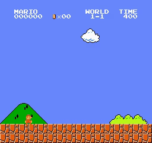
    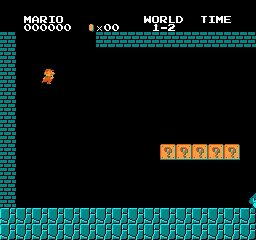
    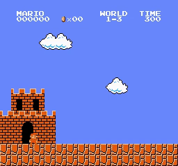
    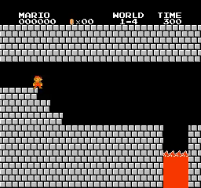
</div>
<div style="display: flex; gap: 5px; margin-bottom: 5px;"> 
    
    
    
    
</div>
<div style="display: flex; gap: 5px; margin-bottom: 5px;"> 
    
    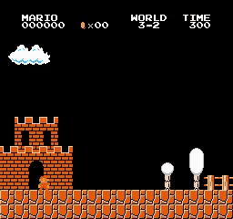
    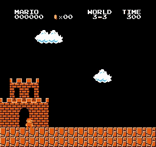
    
</div>
<div style="display: flex; gap: 5px; margin-bottom: 5px;"> 
    
    
    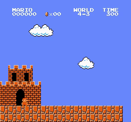
    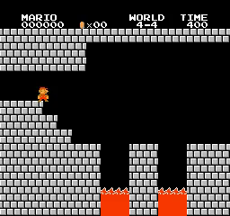
</div>
<div style="display: flex; gap: 5px; margin-bottom: 5px;"> 
    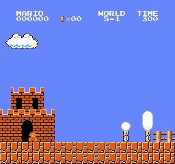
    
    
    
</div>
<div style="display: flex; gap: 5px; margin-bottom: 5px;"> 
    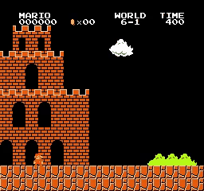
    
    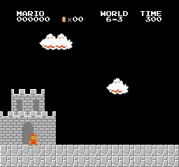
    
</div>
<div style="display: flex; gap: 5px; margin-bottom: 5px;"> 
    
    
    
    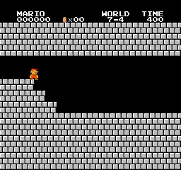
</div>
<div style="display: flex; gap: 5px; margin-bottom: 5px;"> 
    
    
    
    
</div>


## 项目简述 / Project Overview

early文件夹是草稿，是早期的一些尝试，主要是关于动作的设计，还有其他强化学习算法的选择，以及同步异步训练的尝试等，可以忽略。

The 'early' folder contains drafts and early attempts, mainly about action design, selection of other reinforcement learning algorithms, and attempts at synchronous and asynchronous training. This can be ignored.

Final文件夹是最终的版本，可以直接使用，详细介绍在Final文件夹的readme里面。

The 'Final' folder is the final version, ready for direct use. Detailed introduction is in the readme file of the Final folder.

本项目分为3个阶段：

This project is divided into 3 stages:

1. **训练阶段** / **Training stage**: 主要是直接调整学习率和衰减步数的最大回合数，完成所有关卡；
   
   Mainly adjusting learning rate and decay steps for maximum episodes to complete all levels.

2. **再训练阶段** / **Retraining stage**: 对第一阶段没有达到80%的agent进行再训练，但在第一阶段经过大量的调参下，只有8-4经历了这个阶段，最终达到标准；
   
   Retraining agents that didn't reach 80% in the first stage. After extensive parameter tuning in the first stage, only 8-4 went through this stage and finally met the standard.

3. **蒸馏阶段** / **Distillation stage**: 这是还没有完成的阶段，主要是想将32个agent的性能集中到一个agent上，目前还在尝试。
   
   This is an uncompleted stage, mainly aiming to concentrate the performance of 32 agents into one agent. Currently still in progress.

## 遗憾 / Regrets

1. **一开始我的目的是由agent直接输出动作以及持续的时间，无限接近人类操作的过程，但是经过一些努力，发现不行，于是降低了难度，直接输出动作，以及一个固定的时间——4帧，这才完成了所有关卡。**

   Initially, my goal was to have the agent directly output actions and their duration, infinitely close to the human operation process. But after some efforts, I found it unfeasible, so I lowered the difficulty by directly outputting actions and a fixed time - 4 frames, which finally completed all levels.

2. **offpolicy方法的尝试，我试过DQN，SAC，TD3，offpolicy-ppo，发现他们都不如onpolicy-ppo，我分析了一些原因，比如样本利用率，或者我代码写错了等，因为时间关系就先搁置在这里了；蒸馏阶段是后期想到的，目前没做完，用了模仿学习去学习那些已训练好的agent的dataset，但最终表现只有1/10的样子吧，后面考虑数据集太小了用多进程持续的生成数据集，也考虑过net2net的方法，但是时间关系都只有搁置了。**

   Attempts with off-policy methods. I tried DQN, SAC, TD3, off-policy-ppo, but found they were not as good as on-policy-ppo. I analyzed some reasons, such as sample utilization rate, or possible errors in my code. Due to time constraints, I had to put it aside for now. The distillation stage was a later idea, currently unfinished. I used imitation learning to learn from the datasets of trained agents, but the final performance was only about 1/10. Later, considering the dataset was too small, I thought about using multi-processing to continuously generate datasets, and also considered the net2net method, but due to time constraints, they were all put aside.

有很多有趣的实验都可以在这32个agent之下展开，比如让一个学生agent学习10个教师agent，并达到一定表现去看看那些没有训练过的关卡的通过率；或者是改变输入，不对图片做任何的处理，来引导学生agent达到教师agent的表现；或者观察动作序列，让一连串重复的动作结合到一起，生成新的标签，得到[动作，持续时间]，来曲线救国；等等。

There are many interesting experiments that could be conducted with these 32 agents. For example, having a student agent learn from 10 teacher agents and achieve certain performance to see the pass rate of untrained levels; or changing the input, not processing the images at all, to guide the student agent to reach the teacher agent's performance; or observing action sequences, combining a series of repeated actions together to generate new labels, obtaining [action, duration], as an indirect approach; and so on.

可惜我暂时没时间了。。。

Unfortunately, I don't have time for now...

我还想看看其他的方法：NGU，R2D2，Agent57，AlphaGo，AlphaZero，MuZero等，但暂时只能到这了。

I also want to look at other methods: NGU, R2D2, Agent57, AlphaGo, AlphaZero, MuZero, etc., but for now, this is as far as I can go.


## 项目的使用 / Project Usage

我在 AutoDL 云 GPU 平台上完成了所有实验，使用的显卡是 2080ti。在自己的电脑上，我仅进行了一些调试工作。项目所需的所有包都记录在 `requirements.txt` 文件中，大家可以根据文件中的内容和指定的顺序自行安装。

I completed all experiments on the Autodl cloud GPU platform, using a 2080ti graphics card. On my own computer, I only performed some debugging tasks. All the packages required for the project are listed in the `requirements.txt` file, and you can install them in the specified order.


### 训练模型 / Model Training

要训练模型，请进入 `Final/Nvs1/ppomax/train` 目录，然后执行以下命令：

```bash
python main.py --env SuperMarioBros-1-1-v0 --max_timesteps 800
```


您可以在 `main.py` 文件的 `Hyperparameters` 类中修改学习率 (`learning_rate`) 和最大训练回合数 (`total_timesteps`)。**注意**，命令行参数 `--max_timesteps` 实际上对应的是总训练回合数 (`total_timesteps`)，而代码中的 `max_timesteps` 是指学习率衰减的最大回合数。

To train a model, navigate to the `Final/Nvs1/ppomax/train` directory and execute the following command:

### 测试模型 / Model Testing

要测试模型，请将 `Final/Nvs1/ppomax/test` 目录放入 `Final/Nvs1/ppomax/train` 或 `Final/Nvs1/ppomax/defectmodel` 目录中，然后执行以下命令：

To test the model, move the `Final/Nvs1/ppomax/test` directory into either the `Final/Nvs1/ppomax/train` or `Final/Nvs1/ppomax/defectmodel` directory. Then, run:


```bash
python main.py --env SuperMarioBros-1-1-v0 --test
```

### 继续训练模型 / Model Retraining

要继续训练模型，可以将 `Final/Nvs1/ppomax/test` 目录（如有需要，可以替换其中的 `test/model` 下的模型文件）放入 `Final/Nvs1/ppomax/retrain` 目录中，然后按照与训练模型相同的步骤操作。

To retrain a model, move the `Final/Nvs1/ppomax/test` directory (you can replace the model files within `test/model` if needed) into the `Final/Nvs1/ppomax/retrain` directory. Then, follow the same procedure as model training.


